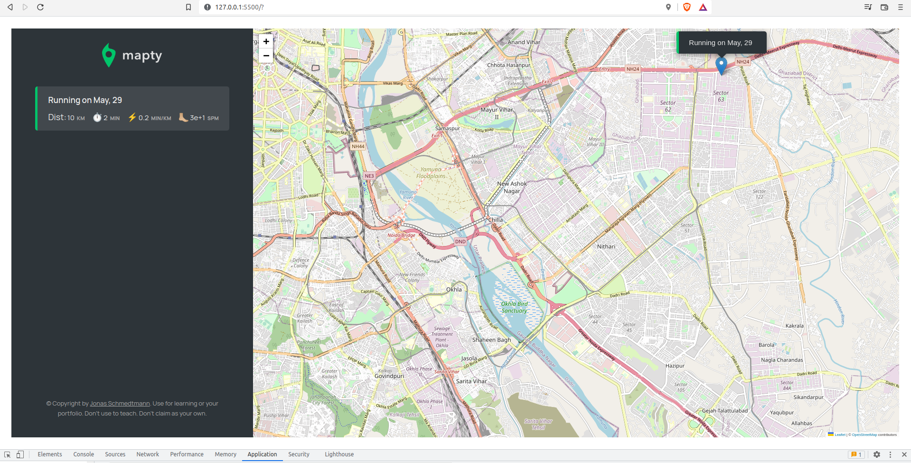
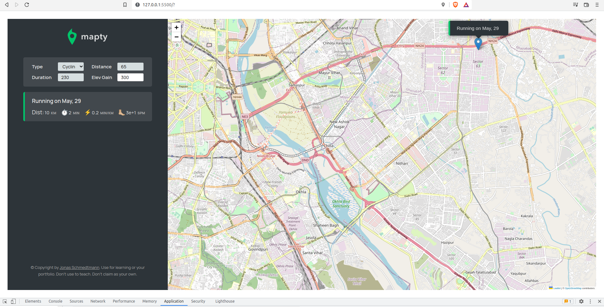
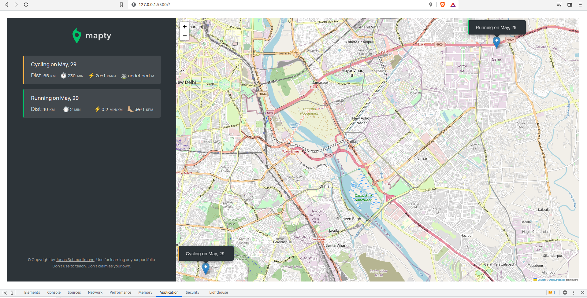
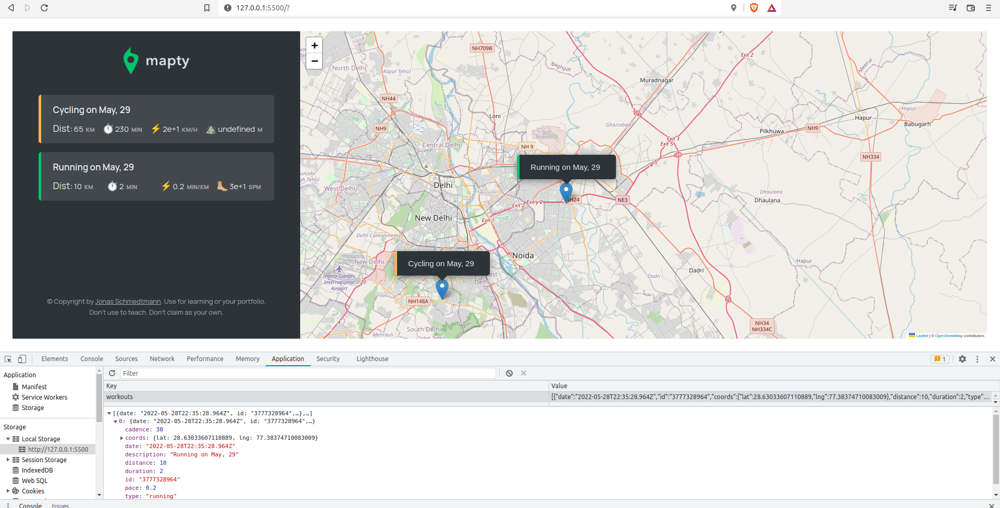

# Mapty-app
A workout logging app made using Javascript 2022 features like purely private properties and methods.

## App Architecture:

## Control Flow Diagram:

## App Screenshots:

### LocalStorage State:

**project guidance credit: Jonas Schmedtmann
